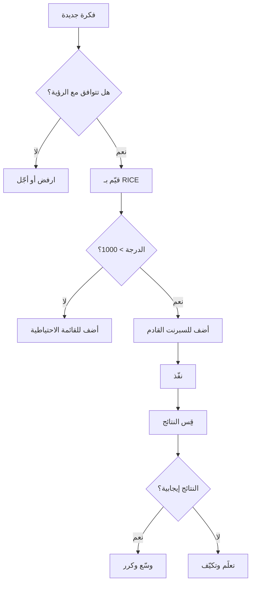

في عالم ريادة الأعمال والتقنية، لا يوجد مورد أثمن من الوقت. كل يوم، نواجه عشرات القرارات: ما الميزة التي نبنيها أولاً؟ أي عميل نخدم؟ أي مشكلة نحل؟ الفرق بين المشاريع الناجحة والفاشلة غالباً ما يكون في جودة هذه القرارات.

## لماذا تفشل معظم المشاريع؟

> "الناس لا يفتقرون إلى القوة، بل يفتقرون إلى الإرادة."
> — فيكتور هوغو

المفارقة المؤلمة هي أن معظم المشاريع لا تفشل بسبب نقص الموارد أو المال أو حتى الموهبة. تفشل لأن الفرق تحاول فعل كل شيء في وقت واحد. هذا ما أسميه **"لعنة الطموح المفرط"**.

تخيل فريقاً من خمسة مطورين يعملون على عشرين ميزة مختلفة. كل مطور يقفز بين أربع مهام. النتيجة؟ لا شيء يُنجز بشكل كامل. كل ميزة تتأخر. الجودة تتراجع. الفريق يُرهق.

### الأعراض الشائعة لسوء الأولويات

1. **الاجتماعات المتكررة بدون قرارات**: عندما تُعقد الاجتماعات لمناقشة نفس المواضيع مراراً
2. **التبديل المستمر بين المهام**: المطور الذي يعمل على ثلاث ميزات لن يُنهي أياً منها بسرعة
3. **الإطلاقات المتأخرة دائماً**: لأن كل شيء "مهم" و"عاجل"
4. **الإرهاق والتسرب الوظيفي**: الفرق المُثقلة تفقد أفضل عناصرها

---

## مصفوفة آيزنهاور: الأداة الأولى

الرئيس الأمريكي دوايت آيزنهاور قال ذات مرة:

> "ما هو مهم نادراً ما يكون عاجلاً، وما هو عاجل نادراً ما يكون مهماً."

هذه الحكمة أصبحت أساس مصفوفة تحمل اسمه، وهي أداة بسيطة لكنها فعالة جداً:

| | عاجل | غير عاجل |
|---|---|---|
| **مهم** | افعله الآن | جدوله |
| **غير مهم** | فوّضه | احذفه |

### كيف تُطبق المصفوفة عملياً؟

لنأخذ مثالاً من الواقع. أنت مدير منتج في شركة ناشئة، وهذه قائمة مهامك اليوم:

- إصلاح خلل يمنع العملاء من الدفع (**عاجل + مهم**)
- كتابة وثائق API الجديد (**مهم + غير عاجل**)
- الرد على بريد إلكتروني من مستثمر محتمل (**عاجل + مهم**)
- حضور اجتماع لا علاقة لك به (**عاجل + غير مهم**)
- تحديث صورتك على LinkedIn (**غير عاجل + غير مهم**)

القرار واضح: أصلح الخلل، رد على المستثمر، ثم جدول وقتاً لكتابة الوثائق. اعتذر عن الاجتماع. انسَ LinkedIn.

---

## طريقة MoSCoW: لغة مشتركة للأولويات

عندما يعمل فريق كامل على مشروع، تحتاج إلى لغة مشتركة للأولويات. هنا تأتي طريقة **MoSCoW**:

- **Must have (يجب)**: بدونها المشروع فاشل
- **Should have (ينبغي)**: مهمة جداً لكن ليست حرجة
- **Could have (يمكن)**: لطيفة لو توفر الوقت
- **Won't have (لن)**: مؤجلة لإصدار لاحق

### مثال عملي: تطبيق توصيل طعام

لنقل أنك تبني تطبيق توصيل طعام. هذا تصنيف الميزات:

**Must have (يجب توفرها للإطلاق):**
- تسجيل المستخدم والدخول
- عرض قائمة المطاعم والأطباق
- سلة الشراء والدفع
- تتبع الطلب

**Should have (الأولوية الثانية):**
- تقييم المطاعم والتعليقات
- كوبونات الخصم
- إشعارات حالة الطلب

**Could have (لو سمح الوقت):**
- برنامج الولاء والنقاط
- مشاركة الطلب مع الأصدقاء
- وضع عدم الاتصال

**Won't have (الإصدار القادم):**
- الطلب الجماعي للشركات
- التكامل مع تقويم Google
- الواقع المعزز لعرض الأطباق

---

## إطار RICE: القرارات المبنية على البيانات

للفرق التي تحب الأرقام، إطار **RICE** يوفر طريقة كمية لترتيب الأولويات:

**RICE = (Reach × Impact × Confidence) / Effort**

- **Reach (الوصول)**: كم مستخدم سيتأثر؟
- **Impact (الأثر)**: ما مدى التأثير على كل مستخدم؟ (0.25 = قليل، 3 = ضخم)
- **Confidence (الثقة)**: ما مدى ثقتك بتقديراتك؟ (50%-100%)
- **Effort (الجهد)**: كم أسبوع-شخص مطلوب؟

### حساب RICE لثلاث ميزات

لنحسب RICE لثلاث ميزات محتملة:

**الميزة أ: تحسين سرعة البحث**
- الوصول: 10,000 مستخدم شهرياً
- الأثر: 2 (مرتفع)
- الثقة: 80%
- الجهد: 2 أسبوع

```
RICE = (10000 × 2 × 0.8) / 2 = 8000
```

**الميزة ب: إضافة الوضع الليلي**
- الوصول: 3,000 مستخدم شهرياً
- الأثر: 1 (متوسط)
- الثقة: 90%
- الجهد: 1 أسبوع

```
RICE = (3000 × 1 × 0.9) / 1 = 2700
```

**الميزة ج: نظام توصيات ذكي**
- الوصول: 8,000 مستخدم شهرياً
- الأثر: 3 (ضخم)
- الثقة: 50%
- الجهد: 6 أسابيع

```
RICE = (8000 × 3 × 0.5) / 6 = 2000
```

**النتيجة**: الميزة أ تفوز بفارق كبير!

---

## الكود كأداة للأولويات

للمطورين، إليكم سكريبت بسيط بـ Python لحساب RICE:

```python
def calculate_rice(reach, impact, confidence, effort):
    """
    حساب درجة RICE لميزة معينة
    
    المعاملات:
        reach: عدد المستخدمين المتأثرين
        impact: مستوى التأثير (0.25, 0.5, 1, 2, 3)
        confidence: نسبة الثقة (0.5 - 1.0)
        effort: الجهد بأسابيع-شخص
    
    العائد:
        درجة RICE
    """
    if effort <= 0:
        raise ValueError("الجهد يجب أن يكون أكبر من صفر")
    
    return (reach * impact * confidence) / effort


# مثال على الاستخدام
features = [
    {"name": "تحسين البحث", "reach": 10000, "impact": 2, "confidence": 0.8, "effort": 2},
    {"name": "الوضع الليلي", "reach": 3000, "impact": 1, "confidence": 0.9, "effort": 1},
    {"name": "توصيات ذكية", "reach": 8000, "impact": 3, "confidence": 0.5, "effort": 6},
]

# حساب وترتيب الميزات
for feature in features:
    feature["rice"] = calculate_rice(
        feature["reach"],
        feature["impact"],
        feature["confidence"],
        feature["effort"]
    )

# ترتيب تنازلي
sorted_features = sorted(features, key=lambda x: x["rice"], reverse=True)

print("الميزات مرتبة حسب الأولوية:")
print("-" * 40)
for i, f in enumerate(sorted_features, 1):
    print(f"{i}. {f['name']}: {f['rice']:.0f}")
```

عند تشغيل هذا الكود، ستحصل على:

```
الميزات مرتبة حسب الأولوية:
----------------------------------------
1. تحسين البحث: 8000
2. الوضع الليلي: 2700
3. توصيات ذكية: 2000
```

---

## تدفق عملية الأولويات



---

## مبدأ باريتو: قاعدة 80/20

> "20% من الجهد يُنتج 80% من النتائج."

هذا المبدأ، المنسوب للاقتصادي الإيطالي فيلفريدو باريتو، يُطبق في كل مكان:

- 20% من العملاء يُولّدون 80% من الإيرادات
- 20% من الميزات تُستخدم 80% من الوقت
- 20% من الأخطاء تُسبب 80% من الشكاوى

### كيف تجد الـ 20% الذهبية؟

**الخطوة الأولى: جمع البيانات**

لا تعتمد على الحدس. استخدم التحليلات لمعرفة:
- أي الميزات تُستخدم فعلاً
- أين يقضي المستخدمون وقتهم
- ما الذي يُسبب التحويلات

**الخطوة الثانية: تحديد الأنماط**

ابحث عن الارتباطات:
- هل المستخدمون الذين يستخدمون ميزة X يُحوّلون أكثر؟
- هل وقت الاستجابة يؤثر على الاحتفاظ؟

**الخطوة الثالثة: التركيز بلا رحمة**

بمجرد أن تعرف الـ 20%، ضاعف استثمارك فيها. أوقف كل شيء آخر إن لزم الأمر.

---

## فخاخ الأولويات الشائعة

### 1. فخ "العميل دائماً على حق"

ليس كل طلب من العميل يستحق التنفيذ. بعض الطلبات:
- تُفيد عميلاً واحداً على حساب الآخرين
- تُعقّد المنتج دون داعٍ
- تُبعدك عن رؤيتك الأساسية

**الحل**: استمع جيداً، لكن قرر بناءً على البيانات والاستراتيجية.

### 2. فخ "الميزة اللامعة"

التقنيات الجديدة مغرية. الذكاء الاصطناعي! البلوكتشين! الواقع الافتراضي! لكن:

> "التقنية يجب أن تحل مشكلة، لا أن تبحث عن مشكلة لتحلها."

**الحل**: اسأل دائماً "ما المشكلة التي نحلها؟" قبل "ما التقنية التي نستخدمها؟"

### 3. فخ "نحن مختلفون"

"هذا الإطار لن يعمل معنا. نحن حالة خاصة."

هذا التفكير خطير. نعم، كل شركة فريدة، لكن المبادئ الأساسية للأولويات تعمل في كل مكان.

**الحل**: جرّب الأُطر المُثبتة قبل اختراع العجلة.

---

## دراسة حالة: كيف أنقذت الأولويات شركة ناشئة

**السياق**: شركة SaaS للمحاسبة، 15 موظفاً، إيرادات 500,000 دولار سنوياً، لكن النمو توقف.

**المشكلة**: الفريق يعمل على 40 ميزة مختلفة. لا شيء يُطلق. العملاء يشتكون من البطء.

**التشخيص**: استخدمنا تحليلات الاستخدام ووجدنا:
- 3 ميزات فقط تُستخدم يومياً من 80% من العملاء
- 25 ميزة لم تُستخدم أبداً في الشهر الماضي
- أكثر شكوى: "التطبيق بطيء جداً"

**الحل**:
1. أوقفنا كل التطوير الجديد
2. حذفنا 15 ميزة غير مستخدمة
3. ركزنا شهرين كاملين على تحسين السرعة
4. أطلقنا ميزة واحدة جديدة فقط (الأكثر طلباً)

**النتائج بعد 6 أشهر**:
- سرعة التطبيق تحسنت 300%
- رضا العملاء ارتفع من 6.2 إلى 8.5 (من 10)
- النمو عاد: +40% إيرادات
- الفريق أصبح أكثر سعادة وإنتاجية

---

## أدوات عملية للأولويات

### للأفراد
- **Todoist**: لإدارة المهام اليومية مع دعم الأولويات
- **Notion**: لتنظيم المشاريع والملاحظات
- **Forest**: للتركيز ومنع التشتت

### للفرق
- **Linear**: إدارة مشاريع حديثة مع أولويات واضحة
- **Productboard**: لتجميع طلبات العملاء وترتيبها
- **Miro**: للتخطيط المرئي والتعاون

### للتحليل
- **Mixpanel**: لفهم سلوك المستخدمين
- **Amplitude**: لقياس أثر الميزات
- **Hotjar**: لمشاهدة كيف يستخدم الناس منتجك

---

## الخلاصة: الأولويات فلسفة حياة

الأولويات ليست مجرد تقنية إدارية. هي فلسفة تقول:

1. **الوقت محدود** — اقبل هذه الحقيقة
2. **لا يمكنك فعل كل شيء** — اختر بحكمة
3. **قول "لا" مهارة** — تدرّب عليها
4. **التركيز قوة** — وزّع انتباهك بحذر
5. **القياس ضروري** — لا تحسين بدون بيانات

> "النجاح ليس فعل أشياء كثيرة، بل فعل الأشياء الصحيحة."

ابدأ اليوم. خذ قائمة مهامك. احذف نصفها. ركز على ما يهم حقاً. ستندهش من النتائج.

---

*هل لديك تجارب مع الأولويات في مشاريعك؟ شاركنا في مجتمع البازار الرقمي على واتساب!*

